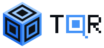

<div align="center">

<picture>
  <source media="(prefers-color-scheme: dark)" srcset="assets/brand/lockup-on-dark.svg">
  
</picture>

</div>

# TQR

TQR is about physical objects that show a different QR code depending on where you look at them from. A small
3D-printed piece held up to a light gives one link from the top, another from the front and a third from the side. A
flat tile version carries five codes, one from straight above and one from each side, and works at phone distance.

## How it works, briefly

- **Silhouette sculptures.** A set of cubes whose shadows along three axes are three QR codes. Carving the common
  volume is easy, but it falls apart into many loose pieces. The solver adds material only where the QR error
  correction can absorb it, plus thin struts where nothing else is possible, so the object prints as one piece and
  each view still decodes. Every view comes with a check that its codewords stay within the correction capacity.
- **Egg-crate tile.** Each QR module is an open cell. Its four walls and its floor are coloured separately, so a viewer
  standing north sees one code, a viewer standing east sees another, and so on.

TQR Studio is the browser app for designing these: type the links, turn the model in 3D, see which link decodes from
the current angle and export files for printing.

## Layout

```text
src/tqr/             Python library: QR structure, silhouette solver, egg-crate tile, mesh export
src/js/              the silhouette solver in JavaScript, used by the web app
apps/web/            TQR Studio (Vite, React, TypeScript, react-three-fiber)
packages/tri-core/   typed ES-module access to the JavaScript solver
scripts/             command-line tools: make_sculpture, make_tile, stl_check, make_brand
experiments/         experiment scripts with their data, logs and figures
tests/               Python tests, the JS and Python parity check and its fixtures
models/              printable STL files
assets/brand/        logo, wordmark and lockups
```

## Try it

Python 3.11 or newer, plus the ZBar library (`brew install zbar` on macOS, `sudo apt install libzbar0` on Ubuntu):

```bash
python3 -m venv .venv && source .venv/bin/activate
pip install -r requirements.txt
pip install -e .

python -m tqr.qrstruct       # self-test of the QR structure maps
python scripts/make_sculpture.py --mode 3qr URL_TOP URL_FRONT URL_SIDE --out sculpture.stl
python scripts/make_tile.py URL_TOP URL_NORTH URL_EAST URL_SOUTH URL_WEST
python scripts/stl_check.py sculpture.stl
```

Node.js 20 or newer for the web app and the JavaScript tests:

```bash
npm install
npm run test:js      # the JavaScript solver must match the Python structure maps
npm test             # unit tests
npm run dev:web      # TQR Studio at http://localhost:5173
npm run build:web    # production build in apps/web/dist, installable and usable offline
npm run build:demo   # everything in one file: apps/web/dist-single/index.html
```

Silhouette sculptures need a backlight and a scan from a few metres away with a zoom lens; the tile works on a table
at about 30 cm.

## Data and licences

Everything in this repository, including the code, the STL models, the experiment data and the brand assets, is
released under the Apache License 2.0 (see [LICENSE](LICENSE)). The models and data were produced by the code here; no
third-party datasets are included, and the example links are placeholders. Third-party packages keep their own
licences, and the web app loads its fonts from Google Fonts under the SIL Open Font License.

## Citation

If this is useful in your work, please cite it with the metadata in [CITATION.cff](CITATION.cff).
